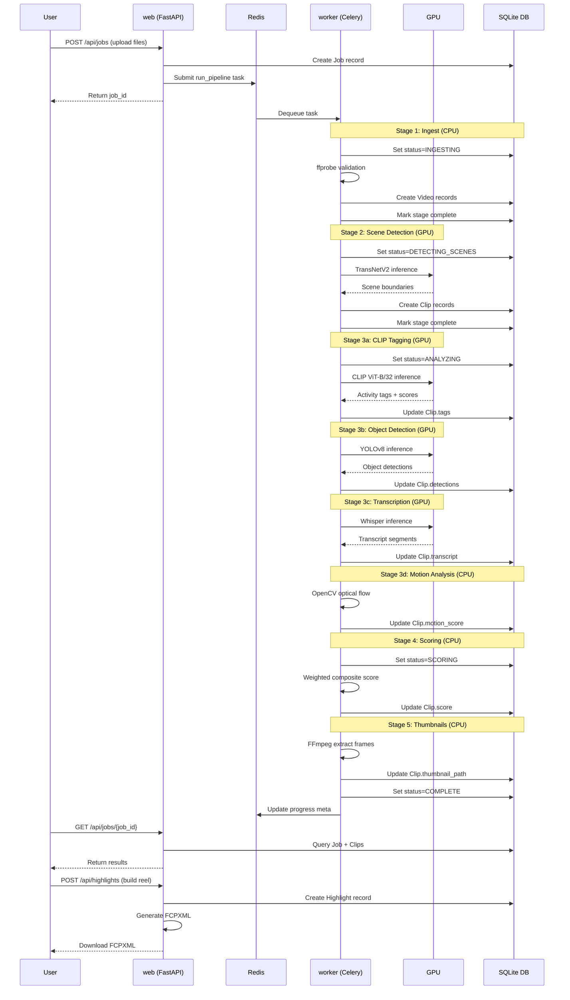
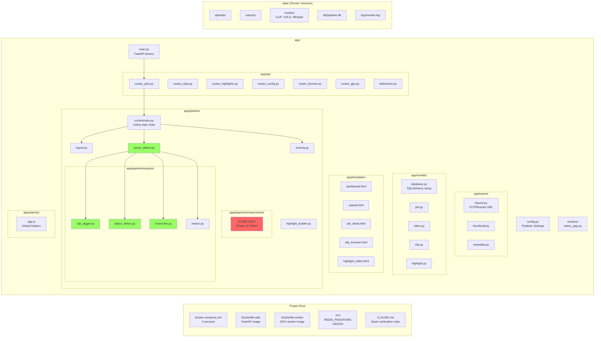

# Video Pipeline Architecture

## System Architecture Overview

```mermaid
graph TB
    subgraph "Docker Infrastructure"
        subgraph "web [FastAPI + uvicorn:8000]"
            WEB[FastAPI App<br/>--reload enabled<br/>2 workers]
            ROUTES[API Routes]
            TEMPLATES[Jinja2 Templates]
            STATIC[Static Files]
        end

        subgraph "worker [Celery GPU Worker]"
            WORKER[Celery Worker<br/>concurrency=2<br/>NO auto-reload]
            GPU[NVIDIA GPU<br/>CUDA Toolkit]
        end

        subgraph "redis [Message Broker]"
            REDIS[(Redis 7<br/>Password Auth)]
        end
    end

    subgraph "Shared Docker Volumes"
        UPLOADS[/data/uploads]
        OUTPUTS[/data/outputs]
        MODELS[/data/models]
        DB[(SQLite DB<br/>/data/db/pipeline.db)]
        NAS[/mnt/nas/gopro<br/>read-only]
    end

    subgraph "FastAPI Application Structure"
        subgraph "app/api/"
            R_JOBS[routes_jobs.py<br/>Create/List Jobs]
            R_CLIPS[routes_clips.py<br/>Clip CRUD]
            R_HIGHLIGHTS[routes_highlights.py<br/>Highlight Builder]
            R_CONFIG[routes_config.py<br/>Settings API]
            R_BROWSE[routes_browse.py<br/>File Browser]
            R_GPU[routes_gpu.py<br/>GPU Status]
            WS[websocket.py<br/>Live Updates]
        end

        subgraph "app/pipeline/"
            ORCH[orchestrator.py<br/>Celery Task Chain]

            subgraph "Pipeline Stages"
                INGEST[ingest.py<br/>ffprobe validation]
                SCENE[scene_detect.py<br/>TransNetV2 GPU]

                subgraph "Analysis"
                    CLIP_TAG[clip_tagger.py<br/>CLIP ViT GPU]
                    YOLO[object_detect.py<br/>YOLOv8 GPU]
                    WHISPER[transcribe.py<br/>Whisper GPU]
                    MOTION[motion.py<br/>OpenCV CPU]
                end

                SCORE[scoring.py<br/>Weighted Scores]
            end
        end

        subgraph "app/export/"
            FCPXML[fcpxml.py<br/>FCP/Resolve XML]
            THUMB[thumbnail.py<br/>FFmpeg Frames]
            META[metadata.py<br/>JSON Export]
        end

        subgraph "app/models/"
            M_JOB[job.py<br/>JobStatus enum]
            M_VIDEO[video.py<br/>Video metadata]
            M_CLIP[clip.py<br/>Scene segments]
            M_HIGHLIGHT[highlight.py<br/>Export reels]
            M_DB[database.py<br/>SQLAlchemy ORM]
        end
    end

    subgraph "Frontend Files"
        DASH[templates/dashboard.html]
        UPLOAD[templates/upload.html]
        JOB_DET[templates/job_detail.html]
        CLIP_BR[templates/clip_browser.html]
        HL_ED[templates/highlight_editor.html]
        APPJS[static/js/app.js<br/>escapeHtml()<br/>formatDuration()<br/>showToast()]
    end

    %% Container connections
    WEB -->|submits tasks| REDIS
    WORKER -->|consumes tasks| REDIS
    WEB --> DB
    WORKER --> DB
    WEB --> UPLOADS
    WEB --> OUTPUTS
    WORKER --> UPLOADS
    WORKER --> OUTPUTS
    WORKER --> MODELS
    WORKER --> NAS
    WEB --> NAS
    WORKER -.uses.-> GPU

    %% Application flow
    ROUTES --> R_JOBS
    ROUTES --> R_CLIPS
    ROUTES --> R_HIGHLIGHTS
    ROUTES --> R_CONFIG
    ROUTES --> R_BROWSE
    ROUTES --> R_GPU
    ROUTES --> WS

    R_JOBS -->|creates| M_JOB
    R_JOBS -->|triggers| ORCH

    ORCH -->|Stage 1| INGEST
    ORCH -->|Stage 2| SCENE
    ORCH -->|Stage 3a| CLIP_TAG
    ORCH -->|Stage 3b| YOLO
    ORCH -->|Stage 3c| WHISPER
    ORCH -->|Stage 3d| MOTION
    ORCH -->|Stage 4| SCORE
    ORCH -->|Stage 5| THUMB

    INGEST --> M_VIDEO
    SCENE --> M_CLIP
    CLIP_TAG --> M_CLIP
    YOLO --> M_CLIP
    WHISPER --> M_CLIP
    MOTION --> M_CLIP
    SCORE --> M_CLIP

    R_HIGHLIGHTS -->|builds| M_HIGHLIGHT
    R_HIGHLIGHTS -->|exports| FCPXML
    R_HIGHLIGHTS -->|exports| META

    WEB --> TEMPLATES
    TEMPLATES --> DASH
    TEMPLATES --> UPLOAD
    TEMPLATES --> JOB_DET
    TEMPLATES --> CLIP_BR
    TEMPLATES --> HL_ED

    TEMPLATES --> APPJS

    %% Styling
    classDef gpu fill:#9f6,stroke:#363,stroke-width:3px
    classDef hot fill:#f96,stroke:#c33,stroke-width:2px
    classDef cold fill:#69f,stroke:#36c,stroke-width:2px
    classDef storage fill:#fc6,stroke:#c93,stroke-width:2px

    class GPU,SCENE,CLIP_TAG,YOLO,WHISPER gpu
    class WEB hot
    class WORKER,REDIS cold
    class UPLOADS,OUTPUTS,MODELS,DB,NAS storage
```

---

## Pipeline Execution Flow



---

## File System Structure



---

## Key Architecture Points

### 1. Docker Container Layout

| Container | Role | Port | Hot-Reload | GPU Access |
|-----------|------|------|------------|------------|
| `web` | FastAPI + uvicorn | 8000 | ✅ Yes | ❌ No |
| `worker` | Celery GPU worker | - | ❌ No (restart required) | ✅ Yes (NVIDIA) |
| `redis` | Message broker | 6379 | N/A | ❌ No |

### 2. Pipeline Stages (6 total)

1. **Ingest** (CPU) - ffprobe validation → `Video` records
2. **Scene Detection** (GPU) - TransNetV2 → `Clip` records
3. **Analysis** (GPU+CPU) - CLIP + YOLO + Whisper + Motion → Clip metadata
4. **Scoring** (CPU) - Weighted composite scores → `Clip.score`
5. **Thumbnails** (CPU) - FFmpeg frame extraction → `Clip.thumbnail_path`
6. **Enhancement** (Stub) - Phase 12 TODO (Gyroflow, RIFE, etc.)

### 3. Data Models

- **Job** - Pipeline execution record (status, config, telemetry)
- **Video** - Source file metadata (duration, resolution, fps, codec)
- **Clip** - Scene segment with analysis results (tags, objects, transcript, score)
- **Highlight** - Export configuration + FCPXML generation

### 4. API Routes

- `/api/jobs` - Job creation, listing, status
- `/api/clips` - Clip CRUD, filtering, search
- `/api/highlights` - Highlight reel builder, FCPXML export
- `/api/config` - Settings management
- `/api/browse` - NAS file browser
- `/api/gpu` - GPU status monitoring
- `/ws` - WebSocket live updates

### 5. Shared Volumes

- `pipeline-uploads` - User-uploaded video files
- `pipeline-outputs` - Generated FCPXML, thumbnails, exports
- `pipeline-models` - AI model cache (CLIP, YOLO, Whisper, TransNetV2)
- `pipeline-db` - SQLite database
- `/mnt/nas/gopro` - Read-only NAS mount for in-place processing

### 6. Critical Workflow Rules

⚠️ **After every code change:**
```bash
# Verify stack health
docker compose ps

# If worker code changed, restart it
docker compose restart worker

# Check for errors
docker compose logs --tail=30 web
docker compose logs --tail=30 worker
```

✅ **Web container** - Auto-reloads Python changes
❌ **Worker container** - Requires manual restart
